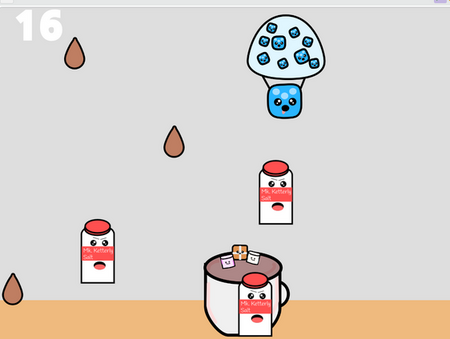
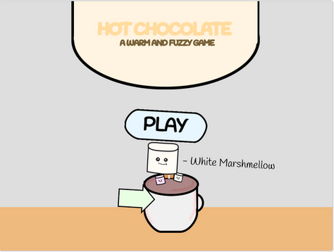

# Hot Chocolate Game

This readme is also available as a Google Doc [HERE](https://docs.google.com/document/d/1cDrDadCQB5LwrXKbIPsh17OuDDUc_q9WbHNSPAtf7zg/edit).

This game involves collecting hot chocolate drops to get a high score. Player moves the character with the mouse. A prototype of this game is available in [Scratch here](https://scratch.mit.edu/projects/996862713/).

* Assume Release Date: June 2024
* Game Designer: Marcos Sardina
* Helper: Sebastian Sardina
* Genre: Calm and Fuzzy
* Start Date: April 12 2024
* Text Engine: Python/Pygame

## How to Play

The aim of the game is to last as long as possible in an everlasting drop. Make sure to dodge objects such as salt and spoons. You only get one life, so make sure to keep it and get the highest score possible!

To score bonus points you can collect little hot chocolate drops (looks like water drops but brown.)  Each time you collect a drop you gain 50 points.

At the beginning of every round, you are allowed to choose which character you want to be. There are marshmallows, hot cross buns, blue berries, straw berries and more. When you are ready to begin you can hit play with your cursor and begin the everlasting drop. Remember to have fun! 

## Screnshots

## Credits

* Artwork - Marcos Sardina
* Code - Marcos Sardina
* Prototype - Marcos Sardina
* Sound/music - freemusicarchive.org
* Program Engine - Visual Studio Code
