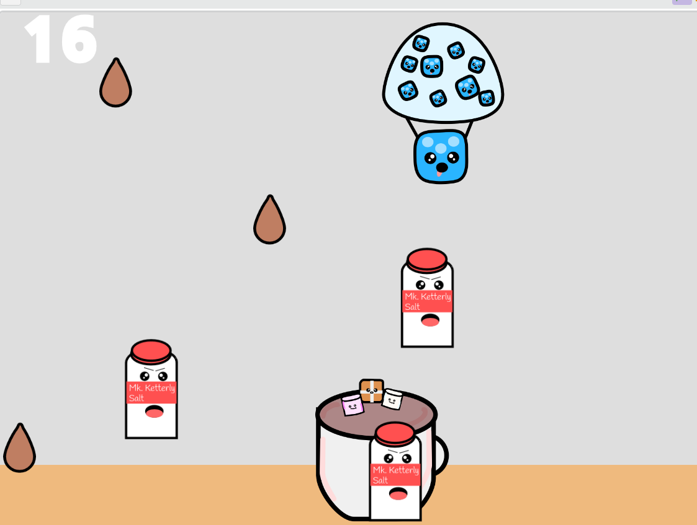
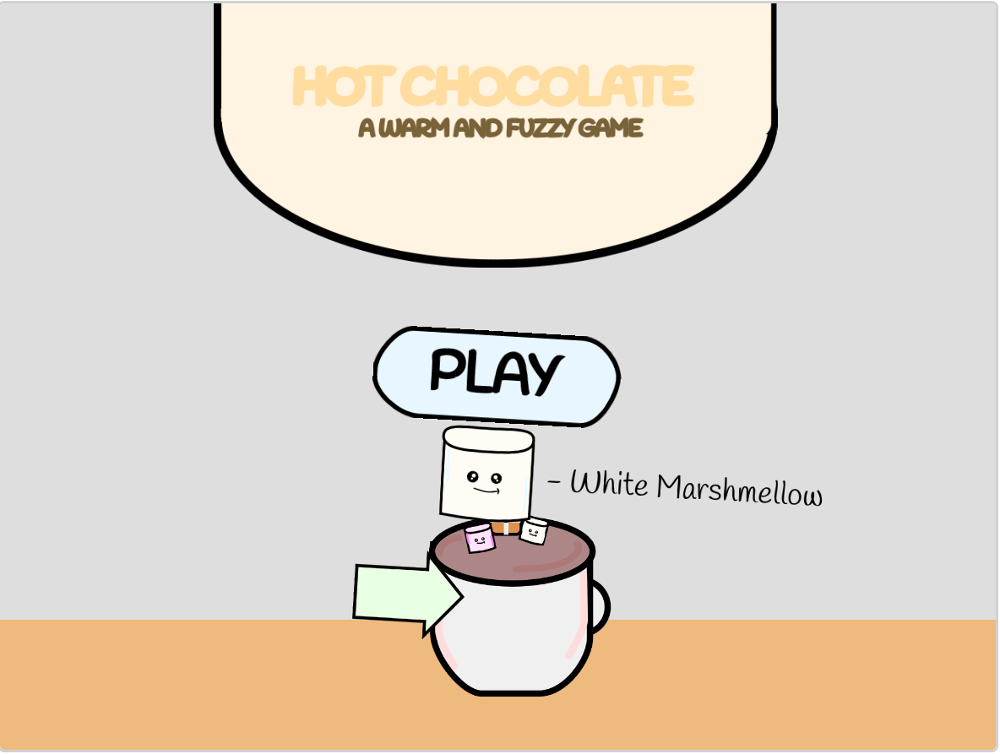

# Hot Chocolate Game

This readme is also available as a Google Doc [HERE](https://docs.google.com/document/d/1cDrDadCQB5LwrXKbIPsh17OuDDUc_q9WbHNSPAtf7zg/edit).

This game involves collecting hot chocolate drops to get a high score. Player moves the character with the mouse. A prototype of this game is available in [Scratch here](https://scratch.mit.edu/projects/996862713/).

* Assume Release Date: June 2024
* Game Designer: Marcos Sardina
* Helper: Sebastian Sardina
* Genre: Calm and Fuzzy
* Start Date: April 12 2024
* Text Engine: Python/Pygame

## Screnshots

## Credits

* Artwork - Marcos Sardina
* Code - Marcos Sardina
* Prototype - Marcos Sardina
* Sound/music - freemusicarchive.org
* Program Engine - Visual Studio Code
